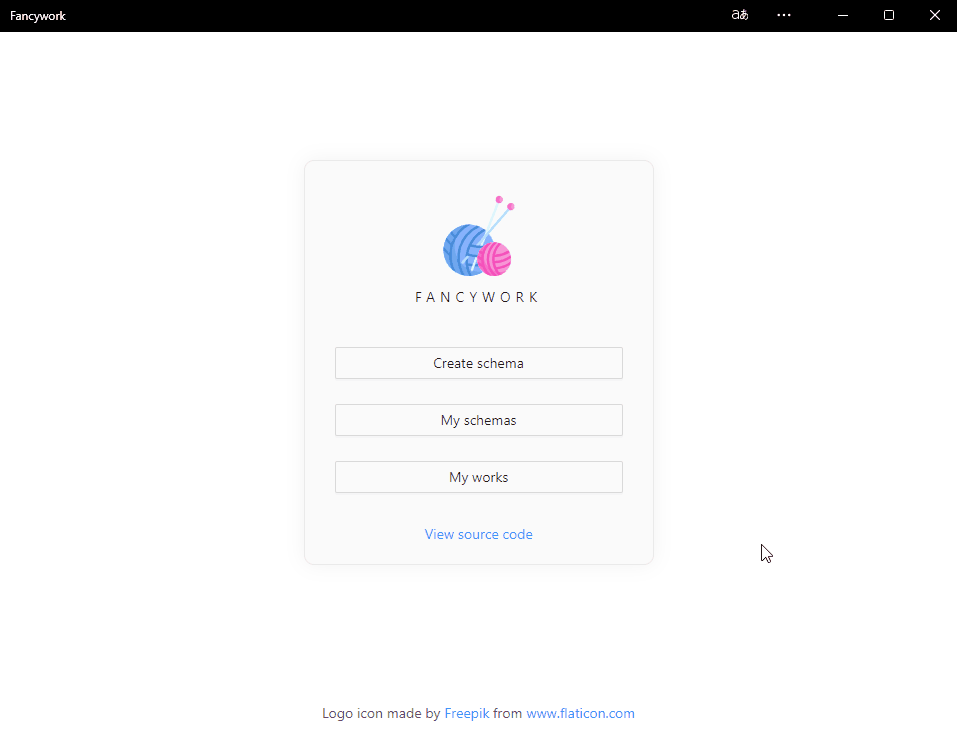
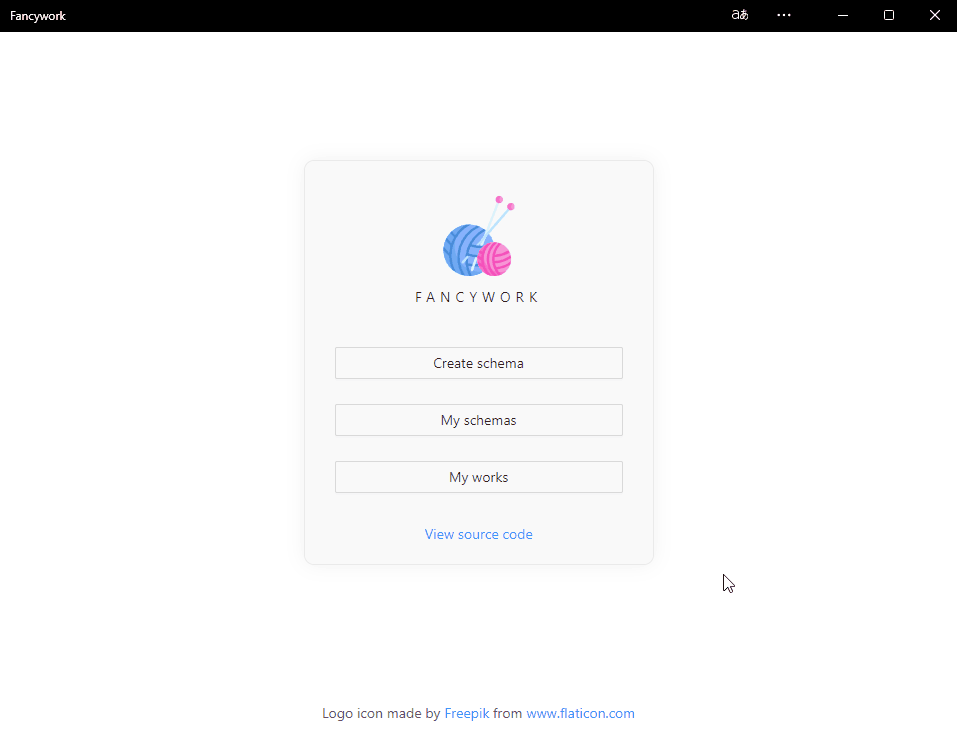
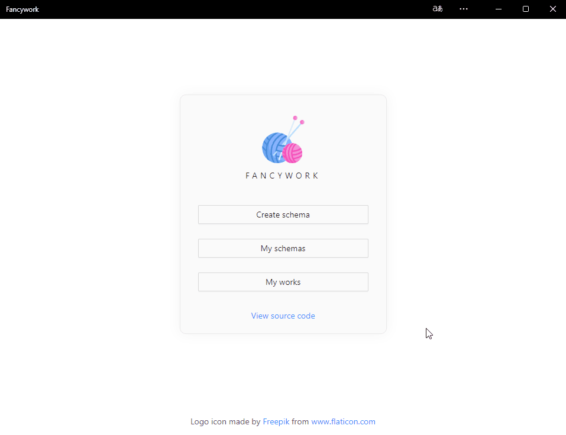
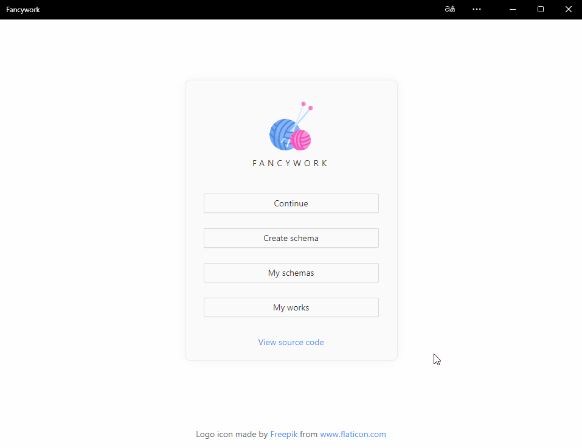

<p align="center">
  
</p>

<h1 align="center">
  Fancywork
</h1>

<p align="center">
  Progressive web application for fancywork
</p>

## Table Of Contents

- [Features](#features)
- [Utils](#utils)
- [Technology Stack](#technology-stack)
  - [Website](#website)
  - [Core](#core)
  - [Core React](#core-react)
  - [Storage](#storage)
  - [Storage React](#storage-react)
- [How To Start](#how-to-start)
- [Demo](#demo)
  - [Create Schema](#create-schema)
  - [View Schema](#view-schema)
  - [Create Work](#create-work)
  - [View Work](#view-work)
- [License](#license)

## Features

- Converting image to an embroidery schema
- Four color palettes: DMC, Anchor, Gamma, Madeira
- Max schema size: 999x999
- Quantization algorithm: k-means clustering
- Three quantization modes: nearest color, contrast color, average color
- Floyd–Steinberg dithering
- Virtualized schema viewer
- Offline mode support

## Utils

- Yarn workspaces
- ESLint
- Stylelint
- Commitlint
- Prettier
- Husky

## Technology Stack

### Website

- TypeScript
- React (create-react-app + craco)
- Workbox
- Ant Design
- SCSS
- CSS Modules

### Core

- TypeScript
- Rollup
- WebGL

### Core React

- TypeScript
- Rollup
- React
- Ant Design
- SCSS
- CSS Modules

### Storage

- TypeScript
- Rollup
- Dexie
- Dexie Observable

### Storage React

- TypeScript
- Rollup
- React
- Ant Design
- SCSS
- CSS Modules

## How To Start

Recommended editor: `Visual Studio Code`

Required tools:

- Git
- Node.js
- Yarn

Download project:

```bash
git clone https://github.com/Trequend/fancywork.git
cd fancywork
```

Install dependencies:

```bash
yarn install
```

Start application:

```bash
yarn run start
```

## Demo

### Create Schema



### View Schema



### Create Work



### View Work



## License

MIT

Logo icon made by
<a href="https://www.freepik.com" title="Freepik">Freepik</a>
from
<a href="https://www.flaticon.com/" title="Flaticon">www.flaticon.com</a>
